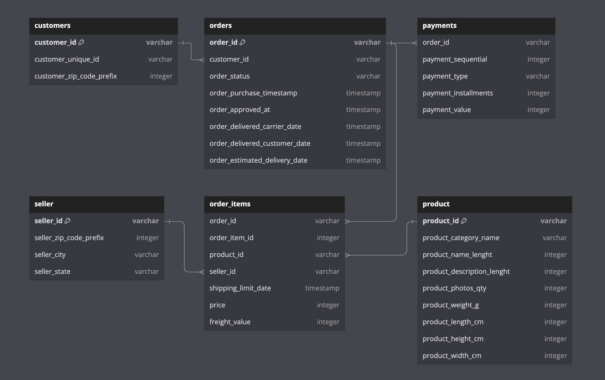

## Project Background

Amazon, a global leader in e-commerce, has successfully expanded across multiple international markets, including Brazil. Given the similarities between Brazil and India—such as large populations, diverse consumer behavior, and growing digital adoption—there is a strong opportunity to replicate successful strategies in the Indian market.
  
This project analyzes Amazon Brazil’s transactional and customer data to uncover trends in payment behavior, product performance, customer segmentation, and sales patterns. The goal is to extract actionable insights that can help Amazon India optimize pricing strategies, improve customer targeting, and enhance overall business performance.

---

## Insights and recommendations are provided on the following key areas:

- **Payment Behavior & Strategy**: Analysis of payment types, order distribution, and transaction consistency to optimize payment strategies.

- **Product & Pricing Analysis**: Evaluation of product pricing ranges, category-level price variations, and identification of high-value product segments.

- **Customer Segmentation & Retention**: Classification of customers based on purchase frequency to identify new, returning, and loyal users.

- **Revenue & Sales Trends**: Analysis of monthly, seasonal, and category-level revenue trends to identify peak sales periods and growth opportunities.

- **High-Value Customers & Products**: Identification of top customers and high-performing products for targeted marketing and loyalty programs.

---

## Data Structure & Initial Checks

The dataset follows a relational structure consisting of multiple interconnected tables, including customers, orders, payments, order_items, products, and sellers. Each table captures a specific aspect of the e-commerce workflow, with relationships linking customers to orders, orders to payments, and order items to products and sellers. This structure enables detailed analysis of transaction behavior, product performance, and customer activity.

---

## Project Resources

- **SQL Scripts:** [View SQL Queries](scripts/analysis_queries.sql)  
- **Dataset:** [Download Dataset](data/amazon_brazil_data.csv)  
- **Report (PDF):** [Download Final Report](report/amazon_analysis_report.pdf)
